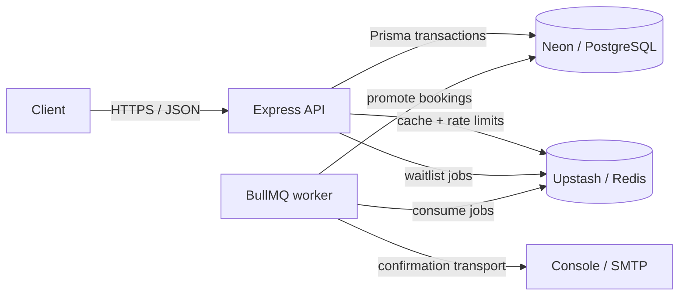

# Eventify v1.0

Eventify is a production-shaped event booking API built with Express, strict TypeScript, PostgreSQL, Redis, and BullMQ. It supports role-based event management, short-lived access tokens with rotating refresh credentials, serializable capacity enforcement, waitlists, cache-aside event discovery, distributed rate limits, and asynchronous confirmation jobs.

**Live API:** <https://eventify-platform-wnhu.onrender.com>

## Architecture



The API and worker are separate processes built from the same image. PostgreSQL is the source of truth; Redis holds disposable caches, fixed-window counters, and durable BullMQ state.

## Run locally in three commands

Prerequisites: Git and Docker Desktop with Compose. From a terminal:

```bash
git clone https://github.com/lana-268/eventify-platform.git && cd eventify-platform
cp .env.example .env
docker compose up --build
```

On PowerShell, use `Copy-Item .env.example .env` for the second command. Compose starts PostgreSQL, Redis, a one-shot migration/seed container, the API, and the worker. When the API health check passes, open <http://localhost:3011/health>. The idempotent seed creates demo events with available seats and these local-only accounts, all using password `Eventify123!`:

- `organizer@eventify.test`
- `admin@eventify.test`
- `attendee@eventify.test`

Stop the stack with `docker compose down`. Add `-v` only when you intentionally want to delete all local PostgreSQL and Redis data.

## API endpoints

Bearer-protected routes expect `Authorization: Bearer <accessToken>`.

| Method | Path | Access | Purpose |
|---|---|---|---|
| GET | `/health` | Public | Process health and uptime |
| POST | `/v1/auth/signup` | Public | Register an attendee account |
| POST | `/v1/auth/login` | Public; 5/min/IP | Return an access token and set the refresh cookie |
| POST | `/v1/auth/refresh` | Refresh cookie | Rotate the refresh token and issue a new access token |
| GET | `/v1/events` | Public | List and filter events with pagination |
| GET | `/v1/events/:id` | Public | Read one cached event |
| POST | `/v1/events` | ORGANIZER, ADMIN | Create an event under the authenticated organizer |
| PATCH | `/v1/events/:id` | Owner, ADMIN | Update an event and invalidate caches |
| DELETE | `/v1/events/:id` | Owner, ADMIN | Delete an event and invalidate caches |
| POST | `/v1/bookings` | Authenticated; 10/10s/user | Confirm a seat or join the waitlist |
| GET | `/v1/bookings/:id` | Owner, ADMIN | Read a booking |
| DELETE | `/v1/bookings/:id` | Owner | Soft-cancel and enqueue waitlist promotion |
| GET | `/v1/venues` | Authenticated | List in-memory venue records |
| GET | `/v1/venues/:id` | Authenticated | Read an in-memory venue record |
| POST/PATCH/DELETE | `/v1/venues[/:id]` | ORGANIZER, ADMIN | Manage in-memory venue records |

## Native development and verification

Node 24 and npm 11 are required. With PostgreSQL and Redis running locally:

```bash
cp .env.example .env
npm install
npx prisma migrate deploy
npx prisma db seed
npm run dev
```

Run the worker separately with `npm run worker`. The quality gates are:

```bash
npm run lint
npm run typecheck
npm test
npm run build
```

Tests never use the database from `.env`: [vitest.setup.ts](vitest.setup.ts) forces `eventify_test` on localhost, and [vitest.config.ts](vitest.config.ts) runs files serially. On a fresh Compose volume, create its schema before the first host-side test run:

```bash
npm run test:prepare
npm test
```

The GitHub Actions `checks` job performs the same migration and gates lint, typecheck, the full test suite, and the production build using dedicated PostgreSQL and Redis service containers.

## Deployment

The production API is designed for a Render web service backed by Neon Postgres and Upstash Redis.

1. Build from this `Dockerfile`; use the image's default `node dist/server.js` command.
2. Apply `npx prisma migrate deploy` against Neon before deployment. A paid Render service can configure the same command as its pre-deploy command.
3. Add `DATABASE_URL`, `REDIS_URL`, `JWT_ACCESS_SECRET`, and `WEB_ORIGIN` in Render's dashboard. Never commit the real values. Render supplies `PORT`.
4. Run `npx prisma db seed` once against Neon, then verify `/health`, signup, login, event listing, and booking at the public URL.

Render's free tier does not provide a background-worker service type. The honest free deployment is API-only: confirmation and waitlist jobs remain safely queued in Upstash until `node dist/worker.js` runs elsewhere. A paid Render background worker can use the same image with that command.

## Decisions and trade-offs

- **Capacity correctness:** booking uses Serializable transactions with bounded conflict retries. A full event creates one `WAITLISTED` row per user/event; promotion re-checks capacity transactionally and chooses the oldest waiter.
- **Authentication:** access JWTs expire after 15 minutes. Seven-day opaque refresh tokens are hashed at rest, rotated atomically, and replay revokes the account's remaining active refresh tokens.
- **Caching:** event detail keys expire after 60–70 seconds. Writes delete detail keys and increment one list-version counter instead of scanning Redis for pages.
- **Rate limiting:** login uses a strict per-IP fixed window; booking uses authenticated user identity so unrelated users behind one network do not consume each other's allowance. Redis failure is logged and fails open to preserve API availability.
- **Queues:** API enqueue attempts are bounded so a Redis outage does not hold cancellation requests open. Promotion is idempotent at database capacity, and confirmation jobs retry with exponential backoff before dead-lettering.
- **Venue scope:** venue CRUD remains the course's in-memory Session 2 implementation. It is authenticated but not durable or horizontally scalable; events, bookings, users, and tokens are PostgreSQL-backed.
- **Email transport:** the worker logs structured confirmation output. SMTP can replace the transport boundary without changing queue processors.

## AI usage and verification

AI helped draft transaction, caching, queue, Docker, CI, test, and documentation changes. I did not accept those drafts as proof. I checked database invariants against the Prisma schema, walked concurrent booking/cache timelines, verified BullMQ v6 against its official node-redis adapter documentation, compiled the emitted JavaScript, and ran Prisma validation/generation, ESLint, TypeScript, and the available automated suites. I also verified the deployed health, authentication, event-listing, and booking flows against Render, Neon, and Upstash, and recorded deliberate red and recovered green CI evidence in the capstone PR.

## License

This educational portfolio project is currently unlicensed; all rights are reserved by the repository owner.
