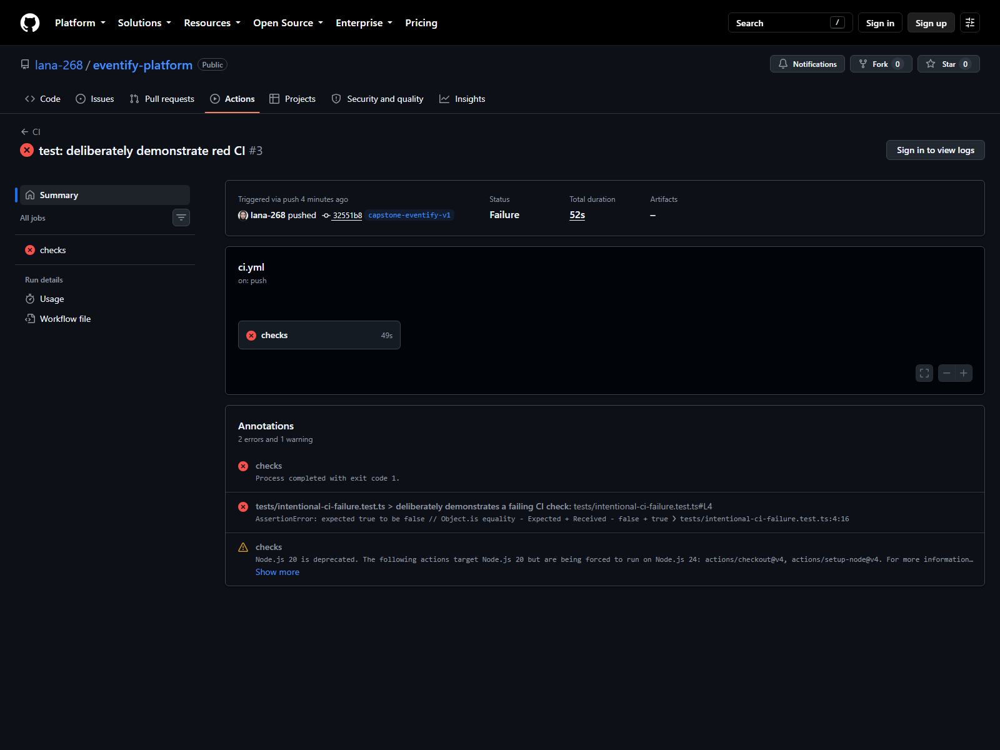

# capstone: Eventify v1.0

## What I built

Eventify v1.0 combines authenticated event management, Serializable booking and waitlist transactions, Redis caching and rate limiting, BullMQ background jobs, an isolated integration suite, a non-root production image, a full local Compose stack, graceful shutdown, and CI quality gates.

## Verification

- [x] Prisma schema validation and client generation
- [x] ESLint
- [x] Strict TypeScript typecheck
- [x] Production TypeScript build
- [ ] Full PostgreSQL + Redis test suite locally
- [x] Green GitHub Actions `checks` job ([recovery run 32649654235](https://github.com/lana-268/eventify-platform/actions/runs/32649654235))
- [x] Deliberately broken commit screenshot showing a red `checks` job ([failed run 32649582344](https://github.com/lana-268/eventify-platform/actions/runs/32649582344))
- [x] `GET https://eventify-platform-wnhu.onrender.com/health` returns 200
- [x] Live signup, login, event listing, and confirmed booking demonstrated

The required capstone integration suite covers signup/login and refresh rotation, ORGANIZER-versus-ATTENDEE event creation, full-event `WAITLISTED` behavior, cancel-then-rebook row reactivation, and cache invalidation. Vitest forces `eventify_test` before imports and disables file parallelism.

## AI assistance

AI drafted portions of the Docker/Compose configuration, graceful-shutdown orchestration, integration-test scaffolding, CI workflow, and documentation. I verified the work by tracing resource ownership per process, inspecting emitted imports, checking every Supertest chain is awaited, running static gates, and exercising the database/Redis suite and deployed API before checking their evidence boxes. I rejected or corrected drafts that risked test access to the development database, omitted generated Prisma artifacts from the runtime image, or claimed provider evidence that had not run.

## Deployment and worker trade-off

**Live URL:** https://eventify-platform-wnhu.onrender.com

Render uses the Docker image; Neon supplies `DATABASE_URL`, Upstash supplies the Redis-protocol `REDIS_URL`, and the remaining secrets are Render environment variables. Because this deployment uses Render's free tier, migrations were applied manually with `npx prisma migrate deploy` against Neon before deployment. Demo data is seeded for grading.

This deployment uses the API-only option because Render's free tier has no background-worker service type. Jobs remain in Upstash until `node dist/worker.js` runs elsewhere; the API and all synchronous booking behavior remain available. A future paid worker can run the same image with that command.
